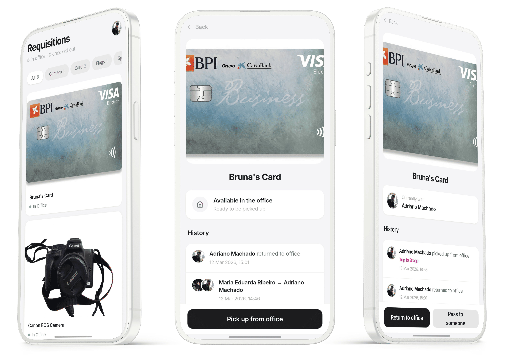

# ESN Porto Requisitions Tracker

A website for ESN Porto volunteers to track and manage office equipment (cameras, cards, etc.). At any moment, users can see what items are in the office, who has them, and a complete history of all transfers.




## Features

* **Real-time Tracking:** See if an item is in the office or held by a volunteer.
* **Audit History:** Complete timeline of check-outs, returns, and peer-to-peer transfers, with optional event name and notes per action.
* **Role-Based Access:** Standard members can check items in/out. Admins can manage inventory, create categories, upload item photos, and manage user roles.
* **QR Code / NFC Tags Integration:** Automatically generates downloadable QR codes for each item, linking to a dedicated QuickScan page.
* **QuickScan Page:** A mobile-first page (`/scan/[id]`) reachable via QR code or NFC tag. Lets anyone pick up, return, or pass an item with a single tap.
* **Sign-In Access Control:** Admins can control who can register. `@esnporto.org` emails are always allowed. External emails can be added to an allowlist, or all emails can be opened with a toggle.
* **Admin Overrides:** Admins can force-return an item or reassign it to any user directly from the item detail page.

## Tech Stack

### Frontend

* [Next.js](https://nextjs.org/) 16 (App Router, React 19, React Compiler)
* Tailwind CSS v4

### Backend & Data

* Next.js API Routes (Node.js)
* Firebase Authentication (Google Sign-In)
* Cloud Firestore (Database)
* Firebase Admin SDK

## Getting Started

### Requirements

* Node.js v20+
* npm, yarn, pnpm, or bun

### Installation

1. Clone the repository:
```bash
   git clone https://github.com/ESN-Porto/requisitions-tracker.git
   cd requisitions-tracker
```

2. Install dependencies:
```bash
   npm install
```

### Configuration

Create a `.env.local` (or `.env`) file in the project root with your Firebase configuration and Admin SDK service account:
```env
# Client-side Firebase Config
NEXT_PUBLIC_FIREBASE_API_KEY=your_api_key
NEXT_PUBLIC_FIREBASE_AUTH_DOMAIN=your_project_id.firebaseapp.com
NEXT_PUBLIC_FIREBASE_PROJECT_ID=your_project_id
NEXT_PUBLIC_FIREBASE_STORAGE_BUCKET=your_project_id.appspot.com
NEXT_PUBLIC_FIREBASE_MESSAGING_SENDER_ID=your_messaging_sender_id
NEXT_PUBLIC_FIREBASE_APP_ID=your_app_id

# Server-side Admin SDK Config (Stringified JSON)
FIREBASE_ADMIN_SERVICE_ACCOUNT={"type":"service_account","project_id":"...","private_key":"...","client_email":"..."}
```

### Development
```bash
npm run dev
```

The app will be available at **http://localhost:3000**.

## Project Structure
```
requisitions_tracker/
├── app/                  # Next.js App Router (Pages & API Routes)
│   ├── admin/            # Admin dashboard (items, categories, users, sign-in settings)
│   ├── api/              # Secure API routes (image serving & admin uploads)
│   ├── item/             # Individual item view, transfer logic, and history
│   ├── scan/             # Mobile-optimised QuickScan page (via QR / NFC)
│   ├── globals.css       # Global styles & Tailwind configuration
│   └── page.js           # Main dashboard
├── components/           # Reusable UI components (Navbar, Cards, Modals)
├── contexts/             # React Contexts (AuthContext)
├── lib/                  # Utilities and Services
│   ├── authMiddleware.js # Server-side token and role verification
│   ├── firebase.js       # Client Firebase initialisation
│   └── firebaseAdmin.js  # Server Firebase Admin initialisation
├── public/               # Static assets and local image uploads directory
├── firestore.rules       # Firestore security rules
└── Dockerfile            # Containerisation configuration
```