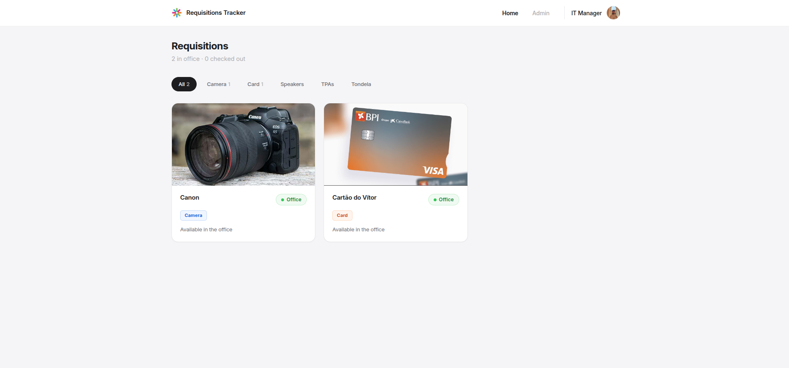
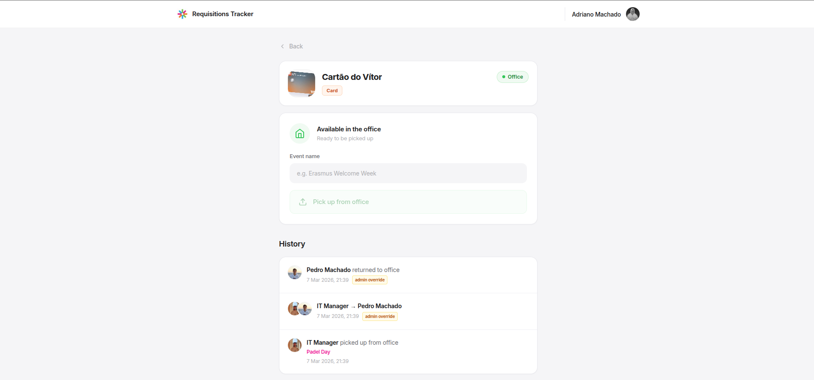
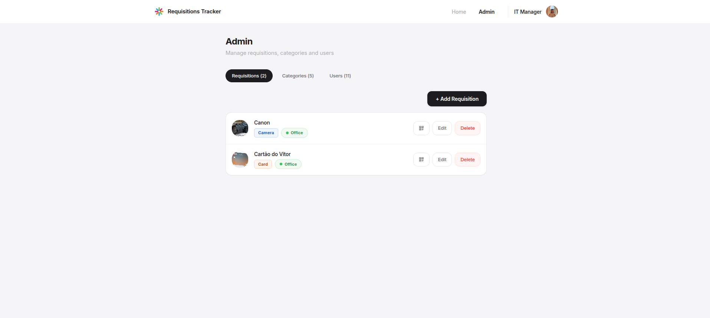

# ESN Porto Requisitions Tracker

This web application allows ESN Porto volunteers to track and manage the office equipment (cameras, Tondelas, cards, etc.). It provides a overview of what items are currently in the office, who has checked them out, and a complete history of transfers.

* **Dashboard**
  Displays available items, items currently out, and quick filters by category.

## Screenshots

|                  Dashboard                  |
| :------------------------------------------------: |
| 
|              Equipment Overview & Filters              |

|                    Item Details                    |
| :------------------------------------------------: |
| 
|              Transfer History & Check-out actions              |

|                  Admin Panel                  |
| :------------------------------------------------: |
| 
|              User, Category, and Item Management              |

## Features

* **Real-time Tracking:** See instantly if an item is in the office or currently held by a volunteer.
* **Audit Trail:** Complete timeline of check-outs, returns, and peer-to-peer transfers.
* **Role-Based Access:** Standard members can check items in/out. Admins can manage the inventory, create categories, upload item photos, and manage user roles.
* **QR Code Integration:** Automatically generates downloadable QR codes for each item to facilitate quick access to its dedicated page.
* **Secure Uploads:** File uploads for item photos are validated server-side using magic bytes to ensure security.

## Tech Stack

### Frontend

* [Next.js](https://nextjs.org/) (App Router, React 19)
* Tailwind CSS (v4)
* `qrcode.react` for QR generation

### Backend & Data

* Next.js API Routes (Node.js)
* Firebase Authentication (Google Sign-In)
* Cloud Firestore (Real-time database)
* Firebase Admin SDK (Secure server-side operations)

## Getting Started

### Requirements

* Node.js (v20+ recommended based on Dockerfile)
* npm, yarn, pnpm, or bun

### Installation

1. Clone the repository:

   ```bash
   git clone [https://github.com/ESN-Porto/requisitions-tracker.git](https://github.com/ESN-Porto/requisitions-tracker.git)
   cd requisitions-tracker

```

2. Install dependencies:
```bash
npm install

```


### Configuration

Create a `.env.local` (or `.env`) file in the project root. You will need your standard Firebase configuration as well as the Admin SDK service account for server-side operations:

```env
# Client-side Firebase Config
NEXT_PUBLIC_FIREBASE_API_KEY=your_api_key
NEXT_PUBLIC_FIREBASE_AUTH_DOMAIN=your_project_id.firebaseapp.com
NEXT_PUBLIC_FIREBASE_PROJECT_ID=your_project_id
NEXT_PUBLIC_FIREBASE_STORAGE_BUCKET=your_project_id.appspot.com
NEXT_PUBLIC_FIREBASE_MESSAGING_SENDER_ID=your_messaging_sender_id
NEXT_PUBLIC_FIREBASE_APP_ID=your_app_id

# Server-side Admin SDK Config (Stringified JSON)
FIREBASE_ADMIN_SERVICE_ACCOUNT={"type":"service_account","project_id":"...","private_key":"...","client_email":"..."}

```

*Note: Certain emails (e.g., `wpa@esnporto.org`, `office.team@esnporto.org`, `treasurer@esnporto.org`) are hardcoded to automatically receive admin rights upon their first login.*

### Development

Start the local development server:

```bash
npm run dev

```

The app will be available at **[http://localhost:3000](https://www.google.com/search?q=http://localhost:3000)**.

## Project Structure

```text
requisitions_tracker/
├── app/                  # Next.js App Router (Pages & API Routes)
│   ├── admin/            # Admin dashboard
│   ├── api/              # Secure API routes (Image fetching & Admin uploads)
│   ├── item/             # Individual item view and transfer logic
│   ├── globals.css       # Global styles & Tailwind configuration
│   └── page.js           # Main dashboard
├── components/           # Reusable UI components (Navbar, Cards, Modals)
├── contexts/             # React Contexts (AuthContext)
├── lib/                  # Utilities and Services
│   ├── authMiddleware.js # Server-side token and role verification
│   ├── firebase.js       # Client Firebase initialization
│   └── firebaseAdmin.js  # Server Firebase Admin initialization
├── public/               # Static assets and local image uploads directory
├── firestore.rules       # Security rules for the database
└── Dockerfile            # Containerization configuration
